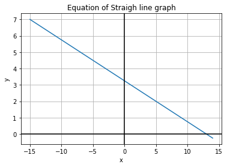

## What will the following program print out below the figure?



```
Line 1 :     x = 0
Line 2 :     y = (-1/4)*(x-1)+3
Line 3 :     print(y)
```

### Answer

The standard order of operations PEMDAS is used to figure out how we will evaluate ``` y = (-1/4)*(x-1)+3 ```

1 - The first line assigns the value of 0 to the variable x.

2 - Since x is 0, we can substitute that value of x into the equation ``` y = (-1/4)*(x-1)+3 ```.

3 - This gives us ``` y = (-1/4)*(0-1)+3 ```.

4 - Simplyfying this further gives us ``` y = (-1/4)*(-1)+3 ```

5 - Now, according to PEMDAS, we evaluate the brackets first and then do the multiplication and finally the addition.

5 - Final simplification step gives us the answer ``` y = (1/4) + 3``` which is 3.25.

6 - The print statement will output the answer 3.25 to the console.

Running the Question4.py file will show the output. 
