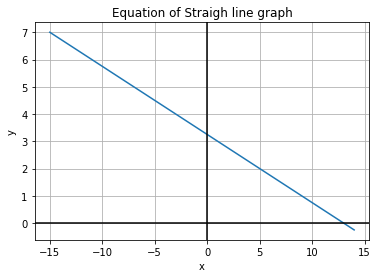

# Module 1 Questions and Answers

## Question 1: What is a program?

A program is basically a set of instructions given to a machine to perform a specific task or a series of tasks.

The program is written in a specific programming language, and in this course, that language is Python. 

A program is responsible for laying out or defining the various decisions that must be followed by a machine in order to 
be able to come up with a solution.

The solution could include manipulating data, or even controlling other pieces of hardware.

### Main parts of a program

A program has the following parts:

#### 1 - Instructions

This is a series of statements that are given to the computer so that the execution of those
statements can result in a solution. Example of these statements could include mathematical operations, processing data
or even interacting with the user. 

#### 2 - One or more programming languages

Programs are written in languages that very from low-level Assembly all the way to high-level Python. They are mostly
written in high-level languages, such as Python, because reading the syntax of high-level languages can be easily read
by a human being. 

#### 3 - A type of program

Programs can be classified in various categories, such as application programs, system programs, utility programs, 
just to name a few. 

Application programs or Apps, are primarily created for the end users to perform specific tasks, such as using Excel to 
work with spreadsheets and browsers to surf the internet, such as Chrome. 

Then you have System programs, which manage the underlying hardware and provide services to other programs such as
operating systems. 

Then you have utility programs, and these perform system maintenance tasks such as antivirus and disk management tools.

Examples of programs include web browsers, apps like the ones in the app stores as well as web apps and desktop apps
and even video games for entertainment, which are highly interactive.

---

## Question 2: What is the difference between an interpreter and a compiler?

The basic difference between an interpreter and a compiler lies in how they process and execute a program.

### The Interpreter

The interpreter reads and executes the code line-by-line and it translates the high level code directly into machine
code at runtime, which means at the time the program is actually run.

An interpreter executes each instruction as soon as it reads the instruction. This is done without producing any
intermediate files that contain machine code. 

Interpreters also stop execution when they encounter an error and this allows the programmer to fix the errors as the
program is still running. 

The speed of interpreted programs is generally slower compared to compiled programs because the code has not been
translated to machine code beforehand, but is instead being translated to machine code at the time that it actually
runs, or runtime. 

The thing that makes interpreters different than compilers is that they have no separate compilation step, they execute
code line by line and they are more flexible for dynamic languages and allow for faster testing. 

Examples of interpreted languages include Python, Javascript, Ruby, Perl and Bash shell scripts. 

### The Compiler

The compiler's job is to translate the entire source code into machine language before the code is executed. And this is
the main difference between the interpreter and the compiler. 

The compiler executes the whole program, does all the error checking and then ends up generating an executable file,
which is a file in machine code that can then be run and distributed as a stand-alone program.

Another key difference between the interpreter and the compiler is that the compiler has to make sure that the program
is successfully compiled, which means that it has to be error-free before the program actually runs. This forces the
developer to fix all the errors before the program is executed. 

The reason why compiled programs run faster than interpreted programs is because the code translation into an executable
file from high-level to machine code is done only once, and then that executable file can then be run repeatedly without 
having to be recompiled repeatedly. 

Examples of languages that use compilers are C, C++, and Java, which compiles to bytecode which is then interpreted by
the JVM.

---

## Question 3: What is wrong with the following code?

```
line 1:  pribt ()'Hello world!")
```

There are 3 things that are wrong with this line of code.

1 - The print command has a typo in it. It should be print, and not pribt.

2 - The way the quotes are used is incorrect because they are mismatched. In Python, the string literals should always
have matching quotes - which are either single quotes ' ' or double quotes " ".

3 - Finally, there is an extra closing parentheses immediately after the opening parentheses. The correct syntax of the
function call should have matching parentheses around the argument.

Therefore the correct code is either with the double quotes:

```
print("Hello, world!")
```

Or with the single quotes:

```
print('Hello, world!')
```

---

## Question 4: What will the following program print out below the figure?



```
Line 1 :     x = 0
Line 2 :     y = (-1/4)*(x-1)+3
Line 3 :     print(y)
```

### Answer

The standard order of operations PEMDAS is used to figure out how we will evaluate `y = (-1/4)*(x-1)+3`

1 - The first line assigns the value of 0 to the variable x.

2 - Since x is 0, we can substitute that value of x into the equation `y = (-1/4)*(x-1)+3`.

3 - This gives us `y = (-1/4)*(0-1)+3`.

4 - Simplyfying this further gives us `y = (-1/4)*(-1)+3`

5 - Now, according to PEMDAS, we evaluate the brackets first and then do the multiplication and finally the addition.

5 - Final simplification step gives us the answer `y = (1/4) + 3` which is 3.25.

6 - The print statement will output the answer 3.25 to the console.

Running the Question4.py file will show the output.

### Implementation (Question4.py)
```python
x = 0
y = (-1 / 4) * (x - 1) + 3
print(y)
```

### Sample Output
```
3.25
```

---

# Discussion

## Question 1 - What is Python?

Python is a programming language that is categorized as a high-level language, in that the instructions that are given to Python when writing code, are given with statements that are legible to a human being. 

For instance, a statement like print("Hey there!") is a one line instruction that prints out "Hey There" in the console when the program is run. 

Unlike other languages like Assembly, writing code in Python does not require the programmer to have knowledge at the machine level using bits and bytes and registers directly. 

Also unlike other languages, the syntax of Python is very easy to read and understand by a human being because the instructions really look as though one is communicating in the English language and therefore that makes it appealing to most programmers, especially beginners that have never coded before. It is probably the least intimidating programming syntax out of all the programming languages ones that I have written code in. 

To get the line "Hello, World!" printed out in Java or C# and may other languages, the syntax that one needs to type is way more cryptic and not as legibly straight forward to read as we would read an instruction in the English language. 

For instance, here is an example of a "Hello, World!" program in Java:
```
public class HelloWorld {
    public static void main(String[] args) {
        System.out.println("Hello, World!");
    }
}
```

And here is one in C#

```
using System;

class HelloWorld {
    static void Main() {
        Console.WriteLine("Hello, World!");
    }
}
```

And here is one in C++

```
#include <iostream>

int main() {
    std::cout << "Hello, World!" << std::endl;
    return 0;
}
```

Here's the code in Assembly language, which absolutely nobody would use today for a very simple program like this, but this is how everything started way back when
```
section .data
    hello db 'Hello, World!',0xA  ; The message, with a newline at the end

section .text
    global _start                 ; Entry point for the program

_start:
    ; Write the message to stdout
    mov eax, 4                    ; syscall number for sys_write
    mov ebx, 1                    ; file descriptor 1 is stdout
    mov ecx, hello                ; pointer to the message
    mov edx, 13                   ; message length (13 bytes)
    int 0x80                      ; make the syscall

    ; Exit the program
    mov eax, 1                    ; syscall number for sys_exit
    xor ebx, ebx                  ; return 0 status
    int 0x80                      ; make the syscall
```

And finally, here is the program that outputs exactly the same thing in Python

```python
print("Hello, World!")
```

Notice all the cryptic syntax that the other three languages use, just to print out a simple greeting? 

With Python, it's a simple one-liner, and when you get to write bigger programs, the simplicity of Python's legibility is maintained and much easier to debug Python code than if that exact same code were to be written in the syntax of some of the languages shown above. 

These things are what made Python one of the most, if not THE most popular programming languages in the world over time, and as it stands today according to the TIOBE index, it is the number one programming language in the world.

You can see the numbers here - https://www.tiobe.com/tiobe-index/

There is also the PYPL Index, which stands for "Popularity of Programming Language" and that website also lists Python as the number one language of choice in the world as of September, 2024. You can see the stats here - https://pypl.github.io/PYPL.html

If you scroll down and look at the "Very Long Term History", you will notice that since its inception in 1991, it has consistently moved up the rankings except for 2014, where it dropped two places, but then started gaining again over the last ten years right up to 2024, where it stands at number one. 

No surprise there! Why would anyone who is getting started as a programmer, voluntarily choose any one of the other three languages shown above, if they had a choice to make on which syntax they found most appealing? 

The choice is clear to me and that's one of the reasons why I have enrolled in this course and decided to make Python THE language of choice in my career going forth. 

So here's what I like about Python:

It is simple! - Python is simple to code, as in, unlike other languages, you don't need to tell it more than you really need to, for it to do the work that it has to. Like in the case of "Hello, World!", just a one-liner is sufficient enough for it to give you what you want. You don't have to write a mini paragraph to do the same thing. I kinda like that!

It is readable! - I like that you can read it as if you're reading something naturally in the English language, and be able to grasp the logic of the code way faster than other syntax. 

And finally, Python is versatile - This means that Python can be used for a wide variety of tasks and in many areas of programming. It has libraries and frameworks, such as Django (my favourite) as well as Flask, for backend coding. It is cross platform, meaning that it can be used on Windows, macOS and Linux. It can also be integrated with other languages. 

## Question 2 - Why do people use Python?

Well, as I have stated in the first question, there are a few reasons why Python is an extremely appealing programming language, to both complete beginners as well as seasoned experts. They are, simplicity, readability and versatility. 

But there are other factors that makes Python appealing.

It is easy to learn! When a programmer is not intimidated by the syntax of the language, that then gives them a peace of mind, especially when they don't have to worry about extra lines of code to get a very simple thing done, like printing out "Hello, World!". When something becomes easy to learn, then it also becomes comforting to actually WANT to code in that language.

I have to be honest with you, out of all the programming languages I have ever written code in, Python is the ONLY programming language where I actually smile while writing code. Imagine that! The simplicity, readability and versatility all make me feel good. I try to make it a habit to write code in such a way, that if I were to pass the code off to someone else, they would understand it faster than in any other language out there - and when I use Python to write that code, it's a breeze for them to understand what's going on. I know so many people who have switched from other languages to Python, because in the end, why not work with a language where the syntax is almost human-like. It's a natural appeal! 

Now having said that, because Python is not a compiled language, but instead an interpreted language, it may not boast the fastest execution times. But for what it's worth, most tasks can be accomplished relatively quickly with Python albeit not in the fastest way, as compiled code might allow. But the hardware these days is so incredibly amazing, that executing interpreted code today is way faster than when I used to code decades ago. I remember using Visual Basic 3 back in the early 90s had no compiler, and it crawled back then. Today it's much different. 

Another reason why people use Python is because it has such a rich ecosystem, meaning that it has libraries and frameworks that can be used to speed up development significantly. There used to be a time when I had a fascination of writing every line of code by myself to feed my developer's ego of having ownership of that code. Then I realized that I was re-inventing the wheel by doing that instead of using libraries that someone else had already written and that I can simply use by plugging it into my existing code within seconds. I realized I was wasting time. From that day onwards, I learnt that writing code is not about feeding my ego, it's about getting things done in the most efficient way possible - and when you use a codebase that has been working and tested for years and years, then why bother writing it from scratch? 

So back to my point - Python libraries are very easy to use and can significantly speed up your programming. 99% of the code that you will ever need already exists in a library out there. The 1% is code that is specific to your company's business rules, and that is the code that most developers are actually writing. Because that code is unique to their needs and it doesn't exist anywhere else. 

Another reason why people use Python is because of its cross platform compatibility. When you can use a language that is supported by multiple operating sytems, then you will not need to learn another programming language just because you are switching from say, Linux to Windows. Back in the day, we could only code C# on a Windows platform because you needed the .NET framework and that did not exist for Linux and Mac. However that changed over the years.

Python, on the other hand, has always been designed be cross-platform from the early days and then over time it has also been refined to work on platform-specific tasks, such as libraries that have to deal directly with the workings of a specific operating system.

Another reason is that Python abstracts system-level programming that developers directly deal with in languages such as C or C++, and that makes Python programs largely independent of the underlying operating system. The proper installation of the Python interpreter will make sure of this so that we as developers don't have to worry about it. 

## Question 3 - What can I do with Python?

Python can be used for web development, data science and analysis of data, machine learning and artificial intelligence, automation and scripting, game development, desktop application development, scientific computing, cybersecurity, networking, DevOps, internet of things, education and learning, cloud computing, robotics, blockchain development, audio and video processing, natural language processing, computer vision, financial applications, bioinformatics, data visualization, testing and quality assurance, content management systems, and much more.

The list is endless and it keeps growing as Python keeps evolving and getting better and better. It's a language that has stood the test of time and has proven itself to be a very reliable and robust language that can be used for almost anything. 

In my case, I am using Python for web development, data science and machine learning. I am also using it for automation and scripting. I am using it for testing and quality assurance. I am using it for data visualization. I am using it for natural language processing. I am using it for computer vision. I am using it for financial applications. I am using it for bioinformatics. I am using it for content management systems. I am using it for blockchain development. I am using it for audio and video processing. I am using it for education and learning. I am using it for cloud computing. I am using it for robotics. I am using it for internet of things. I am using it for DevOps. I am using it for networking. I am using it for cybersecurity. I am using it for scientific computing. I am using it for desktop application development. I am using it for game development. I am using it for automation and scripting. I am using it for data science and analysis of data. I am using it for machine learning and artificial intelligence. I am using it for web development.

I am using it for everything!
